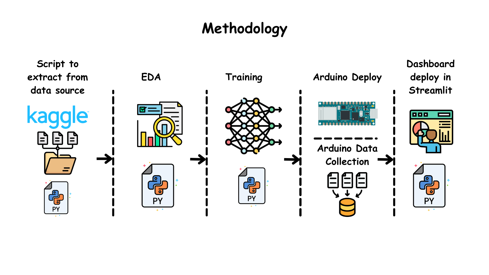

<!--
*** Thanks for checking out this README Template. If you have a suggestion that would
*** make this better, please fork the tinyml-mapping-backlight and create a pull request or simply open
*** an issue with the tag "suggest".
*** Thanks again! Now go create something AMAZING! :D
***
***
***
*** To avoid retyping too much info. Do a search and replace for the following:
*** fullmakeralchemist, tinyml-mapping-backlight, twitter_handle
-->

<!--#     The TensorFlow Microcontroller Challenge    -->
   <h1>Data Insights and Real-Time Predictive Analytics with Streamlit</h1>

<!-- PROJECT LOGO -->

<br />
<p align="center">

  <a href="https://github.com/fullmakeralchemist/">
    
  </a>
  -->
  <br />
  

  
  
  
  
  <a href="https://www.linkedin.com/in/padrondata/">
    
  </a>
  <!--
  <a href="https://twitter.com/makeralchemist/">
    
  </a>
  -->
  
  <!-- <h3 align="center">Tiny ML in Mapping Dance, Visual Arts and interactive museums</h3>-->
  <p align="center">
    <h3>Demo de la app con el Dashboard en Streamlit Share -------></h3>
    <br />
    <a href="https://objectdetectionwebcam.streamlit.app/"><strong>Proyecto Dashboard»</strong></a>
    <br />
  </p>
  <!--
  <p align="center">
  <a href="https://experiments.withgoogle.com/mapping-dance">
    
  </a>
  </p>
  -->
  <br />
</p>
<br />

<!-- ABOUT THE PROJECT -->
## About The Project

<!-- [](https://www.youtube.com/watch?v=3YUVTDTo-Zk) -->

Create a foundational methodology to collect environmental data with an open-source protocol. Conduct an exploratory data analysis to gain deeper insights into the data. Leveraging my knowledge in hydraulics, I will create a data model (structure) that is valuable for hydraulic engineering and hydrology. Once the EDA is complete and if the data proves to be of sufficient quality, I will train a model and deploy it on an Arduino board. Subsequently, I will deploy that model in Streamlit to create a web app that receives data through a communication protocol. This web app will use the real-time input data to predict the current weather status.

### Motivation

This project endeavors to establish a foundational methodology for environmental data collection through open-source protocols. It encompasses key phases, from data exploration and analysis to the development of a specialized data model designed to serve the field of hydraulics engineering and hydrology. Ultimately, the project's goal is to deploy a real-time weather prediction system by harnessing the power of machine learning models integrated into Arduino boards and Streamlit web applications.

#### Empowering Through AIoT: Inclusive Data Solutions

AIoT, the fusion of AI and IoT, conquers data challenges. It enables real-time decision-making, customization for specific issues, and predictive insights, spanning industries. Yet, security and privacy are key. AIoT is a transformative force, making technology universally accessible and useful, with boundless potential.


### Built With

With a lot of love 💖, motivation to help others 💪🏼 and [Python](https://www.python.org/) 🐍, using:

* [Arduino Nano 33 BLE Sense](https://store-usa.arduino.cc/products/arduino-nano-33-ble-sense)
* [Arduino Opla IoT Kit](https://store-usa.arduino.cc/products/arduino-opla-iot-kit)
* [Raspberry Pi 4](https://www.raspberrypi.com/products/raspberry-pi-4-model-b/)
* [Google Colab](https://colab.research.google.com/)  (with its wonderful GPUs)
* Phone with HotSpot
* [Streamlit](https://streamlit.io/)

<!-- GETTING STARTED -->
## Getting Started

Weather prediction has always been a complex puzzle, and the integration of Artificial Intelligence of Things (AIoT) is transforming the way we approach it. Beyond traditional forecasts, AIoT leverages IoT sensor data to enhance our understanding of weather dynamics.

The Power of AIoT
In the realm of weather forecasting, AIoT marks a significant advancement. It seamlessly collects real-time data at the edge, offering deeper insights. Sensors, from those monitoring temperature to wind speed, contribute to a holistic understanding of weather patterns. This is where AIoT shines, enabling us to customize AI models to address specific challenges.

Machine Learning for Weather Prediction
Machine learning takes center stage in deciphering the intricate dance of weather patterns. AI models, trained on vast datasets, can predict everything from temperature fluctuations to storm developments. The key to accurate predictions lies in the data and creating it can be a challenge.

The Role of Exploratory Data Analysis (EDA)
EDA is the compass for weather data analysis. It's the vital first step that uncovers the dimensions of your dataset. From understanding the structure to identifying essential features, EDA equips you with the knowledge to tailor AI models. By exploring the correlations between variables, EDA guides the selection of influential factors, ensuring precise weather forecasts.

In this journey of weather prediction powered by AIoT and machine learning, crafting and fine-tuning your dataset is akin to crafting the pieces of a puzzle. Once it fits perfectly, the picture becomes clear, and the forecast becomes accurate.


## Prerequisites

This is short list things you need to use the guide. 

* Google Acount for Google Colab
* Kaggle 
* Raspberry Pi 4
* Arduino IDE
* Micro USB Cable 
* Arduinos Boards mentioned above

## Introduction 
As a hydraulic engineer, I understand the challenges of sourcing high-quality data, particularly in the context of Mexico, where accessing reliable data can be a formidable task. Many professionals, including my friends working in civil protection, often find themselves manually copying and pasting information from various government portals into Excel, a time-consuming and error-prone process.

In light of these challenges, I embarked on a mission to revolutionize data collection within the environmental and hydraulic domains. Leveraging the capabilities of Arduino-based open-source hardware platforms equipped with sensors for temperature, pressure, humidity, and more, I discovered an efficient method to easily collect historical data. These data streams not only offer convenience but also have the potential to provide robust datasets for developing cutting-edge machine learning models.

This project aims to empower professionals like me and my colleagues in civil protection by integrating this wealth of data into a streamlined workflow. It combines exploratory data analysis (EDA) techniques with TensorFlow, a powerful machine learning framework, to produce actionable insights and real-time predictive analytics, all presented through a user-friendly interface built with Streamlit.

By doing so, we aspire to transform the way hydraulic engineers and environmentalists access and utilize data, making it more accessible, actionable, and capable of driving informed decision-making in critical areas such as flood prevention, water resource management, and environmental risk assessment.


## Prerequisites 
Before getting a local copy up and running the project you need to first follow this simple steps: 
This is a list of things you need to use the software and how to install them. First we're gonna start with the configuration for our Raspberry Pi.

### Raspberry Pi 4 configuration to run the code: 
We need to use Buster version of Raspberry Pi OS or another distribution such as Debian for the MQTT Broker. Before installing the libraries in your Linux Machine run the following code lines in the terminal: 

```
sudo apt update   
sudo apt upgrade   
```

After updating and upgrading we will write the following command to install the Mosquitto Broker enter these next commands: 

```
sudo apt install -y mosquitto mosquitto-clients   
```

Then type the following command, we have to modify a document that was installed to able the MQTT Broker as a public broker in your local WIFI network: 

```
sudo nano /etc/mosquitto/mosquitto.conf   
```

Now add the following lines at the end, without modify the rest of the document (Ctrl+x to save changes): 

```
listener 1883   
allow_anonymous true   
```

Then after saving the document, you have to restart the Mosquitto Broker run the following command and restart your Linux Machine: 

```
sudo systemctl restart mosquitto.service   
```

Also to configure the Broker to start when you start up your Linux machine you have to run the following command in the terminal: 

```
sudo systemctl enable mosquitto.service   
```

To get the IP address that work for us as the direction of our broker run in the terminal the command: 

```
hostname -I   
```

One last thing to check if the Mosquitto broker is running and available run in the terminal the command: 

```
mosquitto -v   
```

Now finishing with the MQTT configuration we need to install the Library Paho-MQTT for Python to control and connect to the Broker, run the following command: 

```
sudo pip install paho-mqtt  
```

## Creating a Streamlit WebApp for Dashboarding and Weather Prediction
Streamlitis an open-source app framework for Machine Learning and Data Science teams. Create beautiful web apps in minutes. Streamlit apps are Python scripts that run from top to bottom. Every time a user opens a browser tab pointing to your app, the script is re-executed. As the script executes, Streamlit draws its output live in a browser.

[Create an app](https://docs.streamlit.io/library/get-started/create-an-app) using Streamlit’s core features to fetch and cache data, draw charts, plot information on a map, and use interactive widgets, like a slider, to filter results.

To setup your Raspberry Pi for the first time check [my tutorial](https://medium.com/@lalodatos/setting-up-your-raspberry-pi-4-wireless-cd3e70a53e3b).


Let’s prepare the virtual environment for the Streamlit app. First let’s create a virtual environment and once created then activate it (Raspberry Pi OS).

```
python -m venv env
source/env/bin/activate
```

Then we have to install Numpy, Plotly, Tensorflow and Streamlit. Try to install in the next order.

```
pip install streamlit
pip install plotly
pip install numpy
pip install tensorflow
```

After this we are ready to try the hello world in Streamlit to check that everything is installed correctly. Create a file called app.py and put the next code lines using your favorite IDE:

```
import streamlit as st
st.write("Hello, World!")
```

Then run it from the terminal in cmd and if everything works fine will open the browser.

```
streamlit run app.py
```

Then to create a tool to upload use a model trained with TensorFlow Lite and use Plotly to Dashboard our weather data  and use the model we need to open the code editor and let’s get started by replacing the previous file and creating a new one named Weather_prediction.py. But we also need a folder called model, and for the moment is everything. Now let’s go to the next step.


### Setup in Windows : 
Is time to configure and set everything on Windows (What I used) to train the model and upload the codes to the boards that we are going to use: 
First of all we are going to set up the Arduino IDE for the 3 boards used in the project. After installing the Arduino IDE in your computer it is necessary to install in the board manager the core needed for each board here are the links to see the Documentation from Arduino as a quick start guide for each board. 

* [Arduino Nano 33 BLE Sense](https://store-usa.arduino.cc/products/arduino-nano-33-ble-sense)
* [Arduino Opla IoT Kit](https://store-usa.arduino.cc/products/arduino-opla-iot-kit)

Also for the BLE Sense board it is necessary to install the library Mbed OS Nano Boards by Arduino in the Boards Manager from the IDE. This library is to upload the code to the board. 

<p align="center">

</p>

For the BLE Sense Board it is necessary to install the LPS22HB library and the Arduino_HTS221 by Arduino in the library Manager from the IDE. This library is to use the sensors in the board.

<p align="center">

</p>

For the BLE Sense Board it is necessary to install the EloquentTinyML library by Arduino in the library Manager from the IDE. This library is to use the Tiny ML in Arduino Board.

<p align="center">

</p>

For the Oplá IoT Kit it is necessary to install the library Arduino SAMD Boards in the Boards Manager from the IDE. This one is for The Arduino MKR WiFi 1010 that is attached to the Opla Carrier to load the code.

<p align="center">

</p>

For the Oplá IoT Kit it is necessary to install the library WiFiNINA by Arduino in the library Manager from the IDE. This one is for WIFI connectivity. 

For the Oplá IoT Kit Board it is necessary to install the library Arduino_MKRIoTCarrier by Arduino in the library Manager from the IDE. This one is for the Carrier control for the sensors. 

### Getting the MQTT library for the Arduino boards: 

For the Arduino Oplá to interact with the Raspberry Pi broker, you need to install the [PubSubClient library](https://github.com/knolleary/pubsubclient). This library provides a client for doing simple publish/subscribe messaging with a server that supports MQTT (basically allows your Arduino to talk with a MQTT Broker). 

[Click here to download the PubSubClient library](https://github.com/knolleary/pubsubclient/archive/master.zip). You should have a .zip folder in your Downloads folder Unzip the .zip folder and you should get pubsubclient-master folder Rename your folder from pubsubclient-master to pubsubclient Move the pubsubclient folder to your Arduino IDE installation libraries folder Then, re-open your Arduino IDE.

The last library is array.h that I included in my repo in the Folder Libraries Because I forgot where I got it [Repo](), repeat the same steps from the PubSubClient library to use it.

Finally we have everything setup in our Arduino IDE and we can start using the boards, but before doing that we need to set up everything in our windows machine to train our model with the Edge Impulse Platform. 

After this we have everything prepared to run our code, but we need a model to run this so wait and train the model.

## Methodology

<p align="center">

</p>

This data collection project is designed to address the challenges faced by professionals in the field of hydraulic engineering, particularly in Mexico, where reliable data sources are often scarce. The primary objectives of the project are as follows:

1. Kaggle Dataset Exploration: In this phase, seek out a database on Kaggle that aligns with the project's objectives and can provide valuable insights. Once identified, extract this dataset to explore its contents and ascertain its suitability for the project's goals.

[Dataset](https://www.kaggle.com/datasets/vonline9/weather-istanbul-data-20092019)

2. Exploratory Data Analysis (EDA):
With the collected data in hand, an exploratory data analysis will be conducted. This stage delves into the data's intricacies, revealing patterns, trends, and valuable insights. The EDA phase is crucial in understanding the dataset's potential and limitations.

3. Arduino Data Collection: Utilize Arduino-based sensors for the collection of real-time data on temperature, pressure, humidity, and other relevant variables if the project looks necessary. This approach provides a cost-effective and efficient means of acquiring valuable data.

4. TensorFlow Modeling: Utilize the TensorFlow framework to design and train machine learning models capable of forecasting weather conditions. These models will leverage input variables from both the Kaggle dataset and, when a sufficient amount of data is available, the Arduino-created database.

5. Streamlit Deployment: Develop an intuitive and user-friendly web application using Streamlit, which will serve as a dynamic dashboard. This application will not only deliver real-time weather predictions utilizing the machine learning models but also present a range of exploratory data analysis (EDA) visualizations. Users will have convenient access to actionable insights and a visual representation of the data, eliminating the need for complex data analysis tools.**


6. Local Data Repository: A key feature of the Streamlit app will be the ability to save the collected data as CSV files. This serves as a starting point for building a local data repository for weather-related information. Over time, this repository will grow, providing valuable historical data for local analysis and decision-making.

7. Arduino Model Deployment: Implement the deployment of the trained machine learning model on an Arduino board using TensorFlow Lite. This ensures that the predictive power is readily available in real-time, even in resource-constrained environments.

Functioning desire result:
<p align="center">

</p>

This is how it will work in Raspberry Pi:
<p align="center">

</p>

## Exploration Data Analysis and Model Training on a custom dataset
In this section, we will dive deeper into the Notebook to do an EDA and explore how to train it .

Exploratory Data Analysis (EDA) is a crucial step in model training. It acts as the compass guiding your journey through the dataset's intricacies, helping you understand its structure and identify key features that influence model performance. EDA unveils data distributions, patterns, and correlations, enabling informed decisions about data preprocessing, feature selection, and augmentation strategies. In essence, EDA sets the stage for a successful model, ensuring it's built on a foundation of insights and data understanding.

TensorFlow, our open-source ally, empowers us in unraveling weather data and enhancing prediction accuracy, bringing deeper insights to meteorology.

You're right; weather prediction may not require data augmentations in the same way as object detection. Here's a revised version of the text focused on weather prediction:

Once armed with a good dataset, we transition to training our weather prediction model. This journey involves presenting the labeled data in batches to our model, progressively enhancing its capacity to map meteorological data to precise forecasts.

<p align="center">

</p>

We need to use Google Colab to see the [EDA and the model Train notebook](https://github.com/fullmakeralchemist/weather_prediction/blob/master/notebooks/)

After we successfully train the model we need two things the model.h file and the tensorflowlite file, we can download the files from Google Colab as shown in the images bellow.


<p align="center">

</p>

<p align="center">

</p>

Now it's time to use our BLE board code you can find it in the Folder [Arduino](https://github.com/fullmakeralchemist/weather_prediction/tree/master/arduino), yout just need to make sure the model.h file is in the same folder the Arduino code, after that you just need to open the file in Arduino a click upload to board.

<p align="center">

</p>

It should look like this one is succesfully working:

<p align="center">

</p>

## Deploy in Streamlit

We are going to use the communication protocol to send the data in real time and the tensorflow lite model will be used in the app to predit how is the weather outside.

As mentioned before we are going to use the Raspberry to install a broker and this broker will work as show in the image below

<p align="center">

</p>

To know more about the protocol check out my tutorial. 

[Arduino and Raspberry](https://medium.com/@lalodatos/applications-with-raspberry-pi-and-arduino-using-mqtt-b6594c29aed8)

With all the elements the final structure of the project is like this:

<p align="center">

</p>